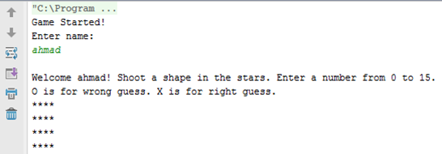
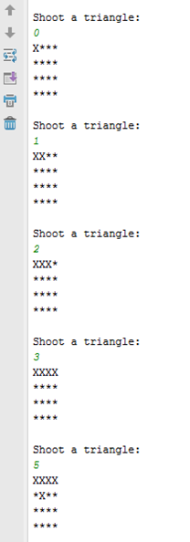
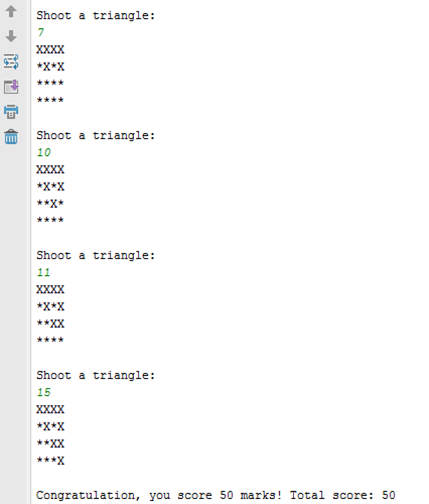

## About

“Shoot the Stars” is a simple game where user will be guessing the connecting dots of a shape (between 0 to 15) from a 4x4 virtual grid of stars. 
Each round ends when user get 5 wrong guesses or gets a complete shape right. 
User can replay or proceed to next round.

This is a university class assignment done in IntelliJ IDEA.